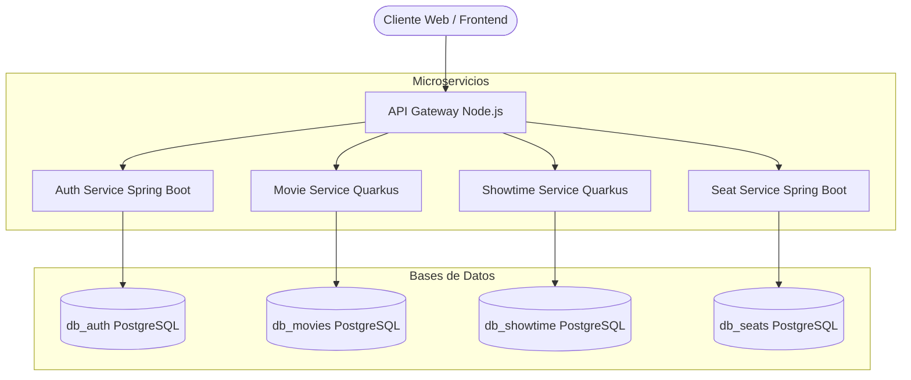
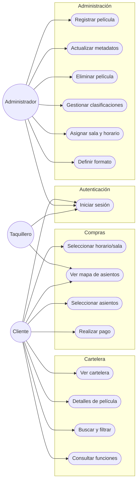
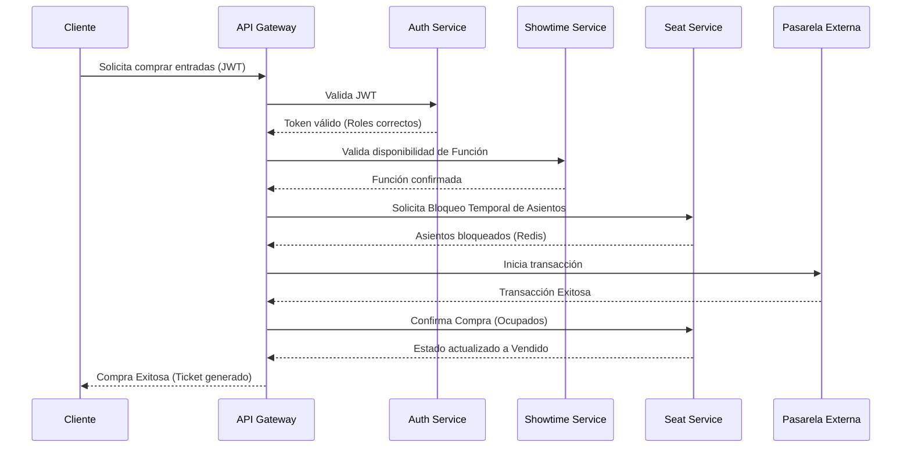

# Arquitectura y Casos de Uso

## 1. Arquitectura de Servicios Autónomos (Monorepo Políglota)
El correcto funcionamiento del sistema de venta de entradas se basa en una arquitectura de microservicios que divide responsabilidades (100% REST vía HTTP/HTTPS) utilizando un patrón de **API Gateway**. Cada servicio tiene su propia base de datos, sin compartir información directamente en persistencia.

### Diagrama de Arquitectura

## 2. Tecnologías Utilizadas
*Revisado e integrado con la especificación técnica del proyecto.*

| Componente | Tecnología | Descripción |
|---|---|---|
| **API Gateway** | Node.js + Express 5 + TS | Único punto de entrada. Orquesta llamadas y valida JWT. |
| **Backend Core** | Spring Boot 4 + Java 17 | Manejo seguro de autenticación (`Auth Service`) y lógica de transacciones complejas (`Seat Service` con Optimistic Locking). |
| **Backend Fast** | Quarkus + Java 17 + Panache | Servicios de alta velocidad y menor consumo para lecturas concurrentes (`Movie Service` y `Showtime Service`). |
| **Frontend** | Angular + CSS / React | Interfaces dinámicas y responsivas. |
| **Base de Datos** | PostgreSQL 15 | Cuatro bases de datos separadas (puerto 5433). |
| **Caché** | Redis | Manejo de bloqueo temporal de asientos y caché de consultas. |
| **Infraestructura** | Docker Compose + Alpine | Despliegue en contenedores ligeros y multi-stage builds. |

## 3. Casos de Uso del Sistema

### Diagrama General

### Detalle de Casos de Uso
*(Tabla resumen del Borrador omitida en el diagrama para lectura a detalle)*

| ID | Caso de Uso | Actores | Descripción |
|---|---|---|---|
| **CU01** | Registrar nueva película | Administrador | Permite registrar una nueva película con datos básicos. |
| **CU02** | Actualizar metadatos y multimedia | Administrador | Permite editar información y actualizar recursos. |
| **CU03** | Eliminar película | Administrador | Permite eliminar películas fuera de cartelera. |
| **CU04** | Gestionar clasificaciones | Administrador | Asignar o modificar clasificación. |
| **CU05** | Asignar sala y horario | Administrador | Programar funciones vinculando película y sala. |
| **CU06** | Definir formato de proyección | Administrador | Configurar 2D, 3D, IMAX. |
| **CU07** | Ver cartelera actualizada | Cliente | Visualizar lista de películas activas. |
| **CU08** | Consultar detalles | Cliente | Ver información específica de película. |
| **CU09** | Buscar y filtrar películas | Cliente | Búsqueda por género, clasificación, etc. |
| **CU10** | Consultar funciones | Cliente | Visualizar horarios por fecha y sala. |
| **CU11** | Seleccionar horario y sala | Cliente | Elegir la función a asistir. |
| **CU12** | Visualizar mapa de asientos | Cliente / Taquillero | Ver estado en tiempo real (Disponible/Ocupado). |
| **CU13** | Seleccionar asientos | Cliente | Marcar los asientos para la compra. |
| **CU14** | Realizar pago | Cliente | Procesar pago con pasarela de pago externa. |
| **CU15** | Iniciar sesión | Todos | Autenticación con credenciales válidas (JWT). |

## 4. Interacción Entre Servicios

Para orquestar estos casos de uso, los servicios se comunican a través del API Gateway. El siguiente diagrama de secuencia ejemplifica el flujo de compra:

| Escenario Operativo | Servicio Iniciador | Acción Técnica | Servicio Destino |
|---|---|---|---|
| **Consulta Cartelera** | Cliente -> Movie | Solicita películas y metadatos. | Movie Service |
| **Consulta Funciones** | Movie Service | Solicita horarios para películas. | Showtime Service |
| **Programación Función**| Admin -> Showtime | Vincula película, sala y horario. | Movie Service |
| **Validación Horarios** | Showtime Service | Verifica no traslapes internamente. | (Interno) |
| **Mapa Asientos** | Cliente -> Showtime | Solicita estructura de sala. | Seat Service |
| **Bloqueo Asientos** | Seat Service | Bloqueo temporal durante compra. | (Interno Redis) |
| **Confirmación Compra** | Seat Service | Cambia estado de Bloqueado a Vendido. | Seat Service |
| **Proceso Pago** | Cliente -> Auth | Valida identidad. | Auth Service |
| **Integración Pago** | Sistema | Envía a pasarela y recibe respuesta. | Pasarela Pagos |
| **Inicio Sesión** | Cliente -> Auth | Emite JWT tras credenciales correctas. | Auth Service |
