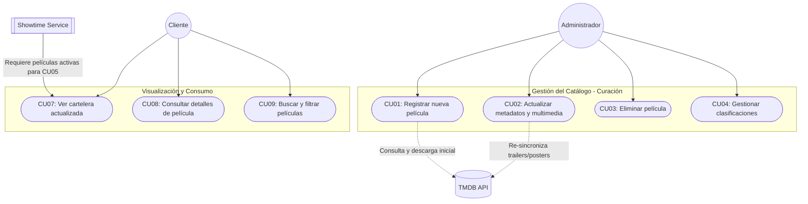

9
# Movie Service (Gestión de Cartelera)

## 1. Responsabilidad
Gestionar el catálogo de películas del cine. Permite al administrador buscar títulos globales usando la API externa de TMDB, curar la información a nivel local y publicarla para los clientes. Provee alta velocidad de lectura para el Front-end sin sobrecargar la base de datos o el ancho de banda del backend.

## 2. Stack Tecnológico
*   **Lenguaje:** Java 17
*   **Framework:** Spring Boot 4
*   **Base de Datos:** PostgreSQL 15 (vía Hibernate ORM con JPA)
*   **Caché:** Redis (Para almacenar respuestas frecuentes de cartelera)
*   **Migraciones:** Flyway
*   **Cliente HTTP Externo:** REST Client Reactive (Para consultar TMDB)
*   **Generador de Código:** OpenAPI Generator (Autogeneración de Interfaces)

## 3. Dependencias Inter-servicio
*   **Llamadas Salientes (Outbound):** 
    *   Externa: A la API pública de **TMDB (The Movie Database)**.
    *   Interna: Ninguna.
*   **Llamadas Entrantes (Inbound):** 
    *   Recibe peticiones exclusivamente desde el **API Gateway**.
    *   Ocasionalmente consultado por el `Showtime Service` para validar la existencia de una película antes de programar una función.

## 4. Configuración y Variables de Entorno

| Variable de Entorno | Descripción | Valor por Defecto / Ejemplo |
| :--- | :--- | :--- |
| `SPRING_DATASOURCE_URL` | Cadena de conexión a la BD | `jdbc:postgresql://localhost:5433/db_movies` |
| `SPRING_DATASOURCE_USERNAME`| Usuario de la BD | `postgres` |
| `SPRING_DATASOURCE_PASSWORD`| Password de la BD | *(Secreto)* |
| `TMDB_API_KEY` | Llave para autenticarse con TMDB | `tu_api_key_de_tmdb_aqui` |
| `QUARKUS_REDIS_HOSTS` | Cadena de conexión a Redis | `redis://localhost:6379` |

---

## 5. Casos de Uso del Negocio (Business Flow)

A continuación se presenta el flujo de negocio mapeado exactamente con los Casos de Uso (CU) oficiales del sistema, para visualizar las capacidades que tendrá este microservicio.



### Lista Oficial de Casos de Uso (Movie Service)
*   **CU01 - Registrar nueva película (Administrador):** Permite registrar una nueva película con sus datos básicos como título, sinopsis, duración y clasificación (apoyándose en la búsqueda en TMDB).
*   **CU02 - Actualizar metadatos y multimedia (Administrador):** Permite editar la información de la película y actualizar imágenes, trailers u otros recursos localmente.
*   **CU03 - Eliminar película (Administrador):** Permite eliminar películas que ya no estarán disponibles en cartelera.
*   **CU04 - Gestionar clasificaciones (Administrador):** Permite asignar o modificar la clasificación de las películas (edad, género, etc.).
*   **CU07 - Ver cartelera actualizada (Cliente):** Permite visualizar la lista de películas disponibles en tiempo real (estado CARTELERA).
*   **CU08 - Consultar detalles de película (Cliente):** Permite ver información detallada de una película (sinopsis, duración, actores, trailer).
*   **CU09 - Buscar y filtrar películas (Cliente):** Permite buscar películas por género, duración o clasificación.

---

## 6. Estrategia de Persistencia y Caché (`db_movies`)

Para garantizar tiempos de respuesta ultrarrápidos (sub-50ms) incluso bajo alta carga de usuarios simultáneos consultando la cartelera, el diseño del servicio emplea técnicas avanzadas de indexación en PostgreSQL 15 y un patrón Cache-Aside en Redis.

### 6.1 Estructura Híbrida de Almacenamiento
*   **Columnas Relacionales:** `id`, `titulo`, `estado` (CARTELERA/PRE-ESTRENO), `clasificacion_edad`. Sirven para filtrar y ordenar (WHERE).
*   **Columna JSONB (`metadata`):** Almacena todo el peso de la información de TMDB (urls de imagen, trailers, lista de actores). Evita la proliferación de tablas puente relacionales innecesarias.

### 6.2 Estrategia de Índices en PostgreSQL (Performance Tuning)
Se aplicarán tres índices especializados en Flyway:
1.  **Índice de Trigramas (`pg_trgm`):** 
    Para optimizar el buscador de clientes. Fragmenta el título en grupos de 3 letras.
    *Implementación:* `CREATE INDEX idx_movies_title_trgm ON peliculas USING GIN (titulo gin_trgm_ops);`
    *Beneficio:* Permite hacer búsquedas parciales (`ILIKE '%Spider%'`) sin incurrir en un *Full Table Scan*, logrando búsquedas en milisegundos y tolerando errores ortográficos menores.
2.  **Índices Parciales (Partial Indexes):**
    Para optimizar la consulta principal de cartelera sin desperdiciar espacio en disco.
    *Implementación:* `CREATE INDEX idx_peliculas_activas ON peliculas (id) WHERE estado = 'CARTELERA';`
    *Beneficio:* El índice resultante es minúsculo en memoria RAM porque ignora miles de películas eliminadas o en pre-estreno.
3.  **Índice Invertido Generalizado (GIN) para JSONB:**
    *Implementación:* `CREATE INDEX idx_movies_metadata ON peliculas USING GIN (metadata);`
    *Beneficio:* Permite extraer o buscar texto dentro del documento JSON (ej. filtrar películas por actor específico) de manera indexada en el futuro.

### 6.3 Estrategia de Memoria RAM (Redis Cache-Aside + Cache Warming)

Las peticiones públicas de lectura NO golpean a PostgreSQL directamente. Para lograr esto sin sufrir del temido **"Cold Start"** (Arranque en frío de la base de datos), el servicio implementa dos estrategias:

1.  **Cache Warming (Calentamiento al Arranque):** 
    Para evitar que el primer usuario de la mañana espere a que PostgreSQL cargue los datos del disco duro, se utiliza un evento `@EventListener(ApplicationReadyEvent.class)` en Spring Boot. Al encender el microservicio, este consulta silenciosamente la cartelera a PostgreSQL y pre-carga la llave `movies:cartelera` en Redis antes de abrir el tráfico al público.
2.  **Cacheo Habitual (Cache-Aside):** 
    Cuando un cliente hace `GET /api/v1/movies`, Spring Boot simplemente lee la llave de Redis y la entrega en sub-milisegundos.
3.  **Invalidación Activa:** 
    Redis no usará un TTL genérico de expiración automática. En cambio, cuando el Administrador altere el estado de una película (ej. ejecutando `PUT /api/v1/movies/123`), el servicio de Spring Boot eliminará forzosamente la llave `movies:cartelera` en Redis, forzando un re-cacheo automático en la siguiente petición.
4.  **Beneficio:** 
    Garantiza consistencia absoluta (los clientes nunca verán una cartelera desactualizada), elimina el "Cold Start" y libera a PostgreSQL del 95% del tráfico público.

👉 **[Ver Documento Completo de Base de Datos: Movie Service](../04_Base_De_Datos/02_Movie_Database.md)**

---

## 7. Manejo de Errores y Excepciones (Consistencia Global)

Para mantener total consistencia con la arquitectura general y evitar que el Frontend necesite analizar múltiples tipos de errores, el `Movie Service` nunca lanzará *Stack Traces* (trazas de error) en texto plano.

### 7.1 Formato JSON Estándar Obligatorio
El servicio responde con un formato JSON idéntico al exigido por el API Gateway. Esto se logra implementando **`@RestControllerAdvice`** globales en Spring Boot que capturan cualquier fallo antes de salir:
```json
{
  "timestamp": "2026-06-25T14:40:00Z",
  "status": 404,
  "error": "Not Found",
  "message": "La película con ID 123 no fue encontrada en el catálogo local",
  "path": "/api/v1/movies/123"
}
```

### 7.2 Tipos de Excepciones Específicas
A nivel interno de código, Spring Boot lanzará Excepciones tipadas que los Controllers convertirán a los códigos HTTP correspondientes:

*   **`MovieNotFoundException` (404 Not Found):** Si se busca una película en TMDB que no existe, o si un cliente solicita un ID local inválido.
*   **`TMDBIntegrationException` (502 Bad Gateway):** Excepción personalizada si TMDB devuelve error 500, hay timeouts de red, o si el plan de API Key excede su límite (*rate limits*). Mantiene al cliente informado sin crashear el servidor.
*   **`ConstraintViolationException` (400 Bad Request):** Errores de validación de `Bean Validation`. (Ej. Si el administrador envía un payload de película donde el campo de título viene vacío o nulo).
*   **`IllegalMovieStateException` (409 Conflict):** Ocurre si, por ejemplo, el Administrador intenta hacer `DELETE /api/v1/movies/123` cuando el Showtime Service ya tiene 5 funciones activas vinculadas a esta película. Prohíbe romper la integridad referencial.

Estos endpoints formarán el contrato que se definirá en `api-spec.yml` para ser autogenerados por OpenAPI Generator. 

> **💡 Nota de Arquitectura (Path Mapping):**
> Para que el código generado coincida perfectamente con el API Gateway, el servicio Spring Boot se configurará con un `server.servlet.context-path=/api/v1`. 
> Esto significa que si en el `api-spec.yml` la ruta es `/movies`, Spring Boot levantará el endpoint en `http://localhost:8082/api/v1/movies` de forma nativa, evitando que el API Gateway tenga que hacer "Path Rewrites" peligrosos.

### 8.1. Endpoints de Administración (Curación de Catálogo local y externo)
> **Seguridad:** Todos estos endpoints son Privados. El API Gateway realizará la **Autenticación** validando el JWT y propagará la identidad (`x-user-roles`). La **Autorización** se hará localmente en el Movie Service (Spring Boot usará `@PreAuthorize("hasRole('ADMINISTRADOR')")` para bloquear intrusos).

*   **`GET /movies/tmdb/search?query={titulo}`**
    *   **Mapeo:** CU01 (Buscar en TMDB)
    *   **Propósito:** Consultar la API de TMDB para obtener una lista de sugerencias globales.
    *   **Respuesta (200 OK):** Arreglo de películas básicas (id de tmdb, título, año, poster miniatura).

*   **`POST /movies/tmdb/import/{tmdbId}`**
    *   **Mapeo:** CU01 (Importar al Cine Local)
    *   **Propósito:** Descarga toda la información de TMDB, la comprime en `JSONB` y crea el registro en PostgreSQL con estado `PRE-ESTRENO`.
    *   **Filtro de Calidad:** El servicio aplica una validación estricta a la respuesta de TMDB. Si la película a importar no cuenta con campos esenciales mínimos (por ejemplo, `overview` / sinopsis, `poster_path`, o lista de `genres`), el backend rechazará la operación con un error HTTP 400 (Bad Request). Esto asegura la limpieza de datos en el sistema.

*   **`GET /movies/admin`**
    *   **Mapeo:** Visualización administrativa.
    *   **Propósito:** Consultar el catálogo local completo. A diferencia del cliente, el administrador puede buscar por nombre localmente y filtrar por cualquier estado (`PRE-ESTRENO`, `CARTELERA`, `ELIMINADA`, `RETIRADA`).
    *   **Query Params:** `status`, `search` (por nombre de película).

*   **`PUT /movies/{id}`**
    *   **Mapeo:** CU02 y CU04 (Actualizar metadatos y clasificaciones)
    *   **Propósito:** Permite sobrescribir manualmente textos locales, clasificaciones y cambiar de estados (`PRE-ESTRENO` a `CARTELERA`).

*   **`DELETE /movies/{id}`**
    *   **Mapeo:** CU03 (Eliminar película - **Soft Delete**)
    *   **Propósito:** Eliminación lógica de la base de datos. No ejecuta un `DELETE` en SQL, sino un `UPDATE` cambiando el estado a `ELIMINADA`. Oculta la película del sistema sin romper el historial de la base de datos.

### 8.2. Endpoints de Consumo (Visualización para el Cliente)
> **Seguridad:** Estos endpoints son Públicos. No requieren JWT y están optimizados con **Redis Cache**.

*   **`GET /movies`**
    *   **Mapeo:** CU07 y CU09 (Ver cartelera, Buscar y Filtrar)
    *   **Propósito:** Retorna la lista de películas activas. Soporta query parameters para buscar y filtrar.
    *   **Query Params:** `genre` (ej. Accion), `search` (búsqueda por texto en nombre). El estado siempre es forzado a `CARTELERA` internamente.

*   **`GET /movies/{id}`**
    *   **Mapeo:** CU08 (Consultar detalles)
    *   **Propósito:** Retorna el documento completo de una película específica leyendo el `JSONB` (sinopsis, actores, trailers reconstruidos).

---

## 9. Integración Técnica con TMDB (Mapeo y Multimedia)

A continuación, se define la especificación estricta de cómo el Backend consume la respuesta de TMDB y construye los recursos multimedia para ser guardados en el `JSONB` local.

### 9.1 Petición de Detalle y Extracción de Datos
Endpoint objetivo: `GET https://api.themoviedb.org/3/movie/{id}?append_to_response=credits,videos,images`

Lista exacta de campos extraídos de la respuesta de TMDB:
- `id` *(Number)*: Identificador único de TMDB.
- `title` *(String)*: Título oficial.
- `overview` *(String)*: Sinopsis completa.
- `runtime` *(Number)*: Duración en minutos.
- `release_date` *(String)*: Fecha de estreno (YYYY-MM-DD).
- `credits.cast[].name`: Nombres de los primeros 5 actores principales.
- `credits.crew[].name`: Nombre de la persona donde `job == "Director"`.

### 9.2 Reconstrucción de Recursos Multimedia
TMDB no devuelve URLs completas, el Backend debe reconstruirlas antes de guardar en base de datos.

**A. URL de Portadas (Imágenes):**
Desde el bloque `"images" -> "posters"`, se extrae el valor `file_path`.
*   **Fórmula:** `https://image.tmdb.org/t/p/w500` + `[FILE_PATH]`
*   **Ejemplo:** `https://image.tmdb.org/t/p/w500/rmCkNtzYR2xTOO3ZXmIqB5zgYdE.jpg`

**B. URL de Trailers (Videos de YouTube):**
Desde el bloque `"videos" -> "results"`, se aplica un filtro obligatorio: `site == "YouTube"` AND `type == "Trailer"`. Se extrae la llave `key`.
*   **Fórmula:** `https://www.youtube.com/watch?v=` + `[KEY]`
*   **Ejemplo:** `https://www.youtube.com/watch?v=1mTjfMFyPi8`

---

## 10. Estrategia de Testing (QA & Automation)

Para asegurar la calidad técnica y evitar regresiones, el servicio implementará una sólida base de pruebas automáticas. **No se usarán bases de datos en memoria (como H2)**, ya que estas no soportan índices avanzados de PostgreSQL como `pg_trgm` o `JSONB`.

### 10.1 Stack Tecnológico de Pruebas
*   **Unit & Integration Tests:** `@SpringBootTest` + `JUnit 5`.
*   **Asersiones REST:** `RestAssured` para simular peticiones HTTP entrantes.
*   **Simulación de Entorno Real:** `Testcontainers`. Levantará contenedores Docker efímeros de PostgreSQL 15 y Redis en cada ejecución de la suite de pruebas. Garantiza que el código probado localmente funcionará idéntico en producción.
*   **Mocking Externa (TMDB):** `WireMock`. Evitaremos golpear la API real de TMDB durante los tests automáticos para no gastar el Rate Limit ni causar *Flaky Tests* por fallos de internet. WireMock levantará un servidor falso que devolverá los JSON pre-grabados detallados en la Sección 9.

### 10.2 Acceptance Criteria (Escenarios Core TDD)

*   **Scenario 1: Búsqueda exitosa en TMDB (WireMock)**
    *   **Given** un Administrador autenticado
    *   **And** WireMock configurado para responder 200 OK con datos de "Inception"
    *   **When** hace GET a `/api/v1/movies/tmdb/search?query=Inception`
    *   **Then** el servicio parsea la respuesta externa y retorna HTTP 200.
*   **Scenario 2: Fallo de Integración Externa**
    *   **Given** que la API de TMDB está caída (WireMock responde 500)
    *   **When** el Admin intenta importar una película
    *   **Then** el servicio atrapa el error y retorna su propio JSON estandarizado con HTTP 502 (Bad Gateway).
*   **Scenario 3: Lectura veloz desde Caché (Redis Testcontainer)**
    *   **Given** un Cliente buscando la Cartelera por primera vez
    *   **When** hace GET a `/api/v1/movies`
    *   **Then** Redis almacena la respuesta y la segunda petición subsecuente no debe emitir logs de consultas SQL (verificable en logs).
*   **Scenario 4: Soft Delete (Postgres Testcontainer)**
    *   **Given** una película importada con estado `PRE-ESTRENO`
    *   **When** el administrador hace DELETE a `/api/v1/movies/123`
    *   **Then** la base de datos no ejecuta un `DELETE` nativo, la fila persiste pero con estado `ELIMINADA`.
